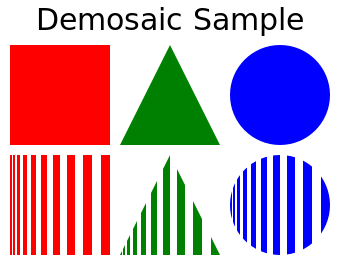
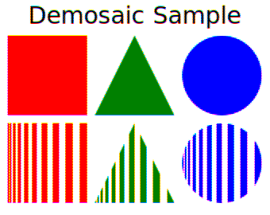
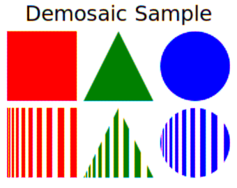
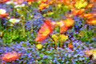

# demosaic

[](https://www.npmjs.com/package/demosaic)
[](https://travis-ci.org/BryceCicada/demosaic)
[](https://coveralls.io/github/BryceCicada/demosaic?branch=master)

Bayer demosaic with NodeJS.

## Motivation
Mostly just experimentation with demosaic implementations for private purposes.

This code is not intended to support proprietary raw image formats from camera manufacturers.

## Usage
- ```Demosaic.nearestNeighbour(args)```
- ```Demosaic.bilinear(args)```

Where args is an object with the following elements:
  - __data__.  Buffer. Raw pixel data. Required.
  - __width__.  Number. Width of image. Required.
  - __height__.  Number. Height of image. Required.
  - __depth__.  Number.  Number of bits per pixel.  8 or 16.  Default 8.
  - __endianness__.  String.  Endianness of pixel data for bilinear demosaic when depth is 16. 'big' or 'little'.  Default 'big'.  Unused for nearest neighbour.
  - __bayer__.  String.  Bayer CFA alignment. 'rggb', 'grbg', 'gbrg' or 'bggr'. Default 'rggb'.

### Bayer alignment

The option _bayer_ desribes the orientation of the 4 pixels in the top left corner of the Bayer CFA.

##### Bayer.RGGB

 | __R__ | __G__ |
 |-------|-------|
 | __G__ | __B__ |

##### Bayer.GRBG

 | __G__ | __R__ |
 |-------|-------|
 | __B__ | __G__ |


##### Bayer.GBRG

 | __G__ | __B__ |
 |-------|-------|
 | __R__ | __G__ |


##### Bayer.BGGR

 | __B__ | __G__ |
 |-------|-------|
 | __G__ | __R__ |


### Examples

```nodejs
let Demosaic = require('demosaic');

let raw = Buffer.allocate(100*100);  // raw pixels;
let rgb = Demosaic.bilinear({data: raw, height:100, width:100});  // Default 8-bit depth
```

```nodejs
let Demosaic = require('demosaic');

let raw = Buffer.allocate(100*100);  // raw pixels;
let rgb = Demosaic.bilinear({
    height:100, 
    width:100, 
    data: raw, 
    depth:16, 
    endianness: 'big'
    bayer: Demosaic.Bayer.RGGB
});
```

## Samples

| Original | Nearest Neighbour | Bilinear | 
|----------|-------------------|----------|
| [](samples/sample.png) | [](samples/sample.nearestNeighbour.png) | [](samples/sample.bilinear.png) |
| [](samples/poppy.jpg) | [](samples/poppy.nearestNeighbour.jpg) | [](samples/poppy.bilinear.jpg) |

## Benchmarks

Comparisons between implementations can be seen with benchmarks:

```npm run benchmark```

For example:
```
nearestNeighbour x 438 ops/sec ±1.63% (80 runs sampled)
bilinear x 286 ops/sec ±1.79% (76 runs sampled)
```

## To Do

 - Some more demosaic algorithms.

## License

MIT License

Copyright 2017 Christopher Nix

Permission is hereby granted, free of charge, to any person obtaining a copy of
this software and associated documentation files (the "Software"), to deal in
the Software without restriction, including without limitation the rights to
use, copy, modify, merge, publish, distribute, sublicense, and/or sell copies
of the Software, and to permit persons to whom the Software is furnished to do
so, subject to the following conditions:

The above copyright notice and this permission notice shall be included in all
copies or substantial portions of the Software.

THE SOFTWARE IS PROVIDED "AS IS", WITHOUT WARRANTY OF ANY KIND, EXPRESS OR
IMPLIED, INCLUDING BUT NOT LIMITED TO THE WARRANTIES OF MERCHANTABILITY,
FITNESS FOR A PARTICULAR PURPOSE AND NONINFRINGEMENT. IN NO EVENT SHALL THE
AUTHORS OR COPYRIGHT HOLDERS BE LIABLE FOR ANY CLAIM, DAMAGES OR OTHER
LIABILITY, WHETHER IN AN ACTION OF CONTRACT, TORT OR OTHERWISE, ARISING FROM,
OUT OF OR IN CONNECTION WITH THE SOFTWARE OR THE USE OR OTHER DEALINGS IN THE
SOFTWARE.

